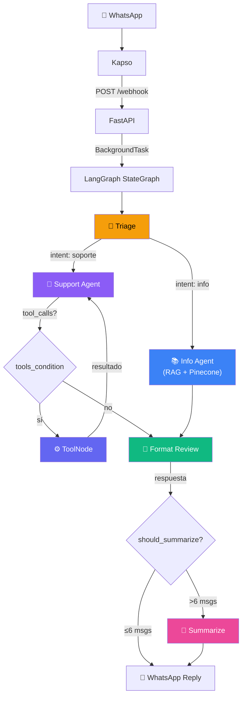

# 📱 FM.inc — Multi-Agent Support System

Sistema multi-agente de soporte técnico para una empresa de telefonía móvil, construido con **LangGraph**, **Pinecone**, **PostgreSQL**, **FastAPI** y **WhatsApp vía Kapso**.

## 🏗️ Arquitectura



## 🚀 Stack Tecnológico

| Componente | Tecnología |
|---|---|
| Orquestación | LangGraph (StateGraph) |
| LLM | OpenRouter → OpenAI GPT-OSS 120B |
| Vector DB | Pinecone Serverless |
| Embeddings | Pinecone Inference (`llama-text-embed-v2`, 1024 dims) |
| DB Relacional | PostgreSQL (Docker) |
| Memoria | LangGraph AsyncPostgresSaver (checkpointer por thread_id) |
| API | FastAPI + Uvicorn |
| WhatsApp | Kapso (proxy de WhatsApp Cloud API) |
| Automatización | n8n |
| Observabilidad | LangSmith + Adminer |
| Desarrollo asistido | Google Antigravity |

## 📋 Setup

### 1. Clonar y configurar entorno

```bash
git clone https://github.com/FacundoMuruchi/support-chatbot.git
cd support-chatbot
python -m venv .venv
.venv\Scripts\activate      # Windows
pip install -r requirements.txt
```

### 2. Configurar variables de entorno

```bash
copy .env.example .env
# Editar .env con tus API keys
```

### 3. Levantar PostgreSQL

```bash
docker compose up -d
```

### 4. Cargar datos en Pinecone

```bash
python scripts/seed_pinecone.py
```

### 5. Iniciar el servidor

```bash
uvicorn app.api.main:app --reload --port 8000
```

### 6. Probar (sin WhatsApp)

```bash
curl -X POST http://localhost:8000/test ^
  -H "Content-Type: application/json" ^
  -d "{\"text\": \"¿Qué planes tienen disponibles?\"}"
```

### 7. Conectar WhatsApp con Kapso

1. Crear cuenta en [Kapso](https://kapso.ai) y obtener API key
2. Configurar las variables `KAPSO_*` en `.env`
3. Exponer el servidor con `ngrok http 8000`
4. Configurar webhook en Kapso apuntando a `https://tu-url-ngrok/webhook`

## 📁 Estructura del Proyecto

```
support/
├── app/
│   ├── core/
│   │   ├── config.py              # Configuración centralizada
│   │   └── llm.py                 # LLM compartido + TONO_NEGOCIO + retry con backoff
│   ├── db/
│   │   ├── database.py            # SQLAlchemy engine/session (TZ: Buenos Aires)
│   │   └── models.py              # Modelo Ticket (status, category enums)
│   ├── rag/vectorstore.py         # Pinecone Inference embeddings wrapper
│   ├── graph/
│   │   ├── state.py               # SupportState (messages, user_phone, intent, summary...)
│   │   ├── graph.py               # StateGraph + ToolNode + ReAct loop + summarize
│   │   └── nodes/
│   │       ├── triage.py          # Router LLM (info | soporte)
│   │       ├── info_agent.py      # Agente RAG (Pinecone + historial + summary)
│   │       ├── support_agent.py   # Agente con ToolNode + InjectedState (tickets DB)
│   │       ├── format_review.py   # Formateador WhatsApp (Python puro, sin LLM)
│   │       └── summarize.py       # Resumen automático de conversación
│   └── api/
│       ├── main.py                # FastAPI app + lifespan + checkpointer
│       ├── whatsapp.py            # Parser Kapso + envío de mensajes
│       └── routes/webhook.py      # Endpoint /webhook
├── tests/
│   ├── test_webhook.py            # Parsing de payloads Kapso
│   ├── test_tools.py              # CRUD de tickets (SQLite en memoria)
│   ├── test_format_review.py      # Límite de caracteres y limpieza de markdown
│   └── test_triage.py             # Routing de intents
├── scripts/seed_pinecone.py       # Carga fm_data.txt → Pinecone (1 chunk por sección)
├── data/fm_data.txt               # Datos de FM.inc (planes, cobertura, FAQ)
├── docker-compose.yml             # PostgreSQL + Adminer
├── pytest.ini                     # Configuración de pytest
└── requirements.txt
```

## 🧠 Conceptos Clave

- **StateGraph**: Grafo basado en estados donde cada nodo lee y escribe un estado compartido.
- **MessagesState**: Los mensajes se *acumulan* automáticamente en vez de reemplazarse.
- **Conditional Edges**: El nodo de triaje decide dinámicamente qué agente invocar.
- **ToolNode + ReAct Loop**: El agente de soporte usa el patrón ReAct *en el grafo*: `support_agent → tools_condition → ToolNode → support_agent`.
- **InjectedState**: El `user_phone` se declara como `Annotated[str, InjectedState("user_phone")]` en las tools — el LLM nunca lo ve en el schema, LangGraph lo inyecta automáticamente desde el estado del grafo.
- **RAG**: El agente de información combina búsqueda semántica (Pinecone) con generación (LLM) para responder solo con datos reales de FM.inc.
- **Pinecone Inference**: Embeddings server-side con `llama-text-embed-v2` (1024 dims). El seeding divide `fm_data.txt` en una sección por chunk usando `CharacterTextSplitter`.
- **Memoria Persistente**: `AsyncPostgresSaver` persiste conversaciones por `thread_id` (número de teléfono) y sobrevive reinicios del servidor.
- **Resumen Automático**: Cuando el historial supera 6 mensajes conversacionales, se resumen los mensajes viejos con `RemoveMessage` y se mantienen solo los 2 más recientes.
- **Format Review sin LLM**: El nodo de formato usa Python puro (regex) en vez de un LLM — elimina markdown, convierte listas a bullets con `•` y trunca a 1000 caracteres. Esto eliminó ~27s de latencia que tenía el nodo anterior basado en un LLM.
- **Retry con Backoff Exponencial**: `invoke_with_retry` (tenacity) maneja `RateLimitError` (429) con espera exponencial: 2s → 4s → 8s, máximo 3 intentos. Necesario para modelos gratuitos en OpenRouter.
- **tono_negocio**: Constante centralizada en `llm.py` que define el tono y estilo de respuesta para todos los agentes — rioplatense, conciso, sin markdown, con emojis moderados.
- **n8n Human-in-the-loop**: Workflow de n8n escucha cambios en la tabla `tickets` vía PostgreSQL LISTEN/NOTIFY y notifica al equipo de soporte por Gmail con botones de aprobación (Send and Wait).

## 🧪 Tests

```bash
pytest tests/ -v
```

Tests que verifican:
- Parsing de webhooks Kapso (text, imagen, vacío)
- CRUD de tickets con SQLite en memoria
- Enums de estado y categoría
- Limpieza de markdown y límite de caracteres en format review
- Routing de intents
